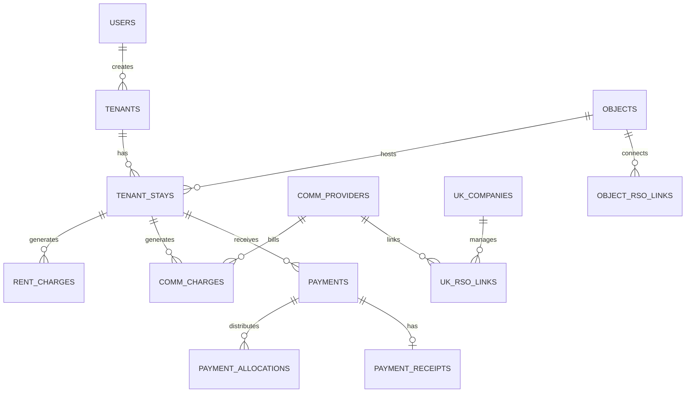

# Database Schema Export for AI Generation

## Quick Reference

**Total Tables:** 20
**Database:** PostgreSQL 15+
**ORM:** SQLAlchemy 2.0 (async)

---

## Table Relationships



---

## Core Entities

### 1. User Management
- `users` - System users (owners, admins)
- `tenants` - Renters/occupants
- `invite_codes` - Invitation system

### 2. Property Management
- `houses` - Buildings
- `objects` - Rental units (apartments)
- `tenant_stays` - Rental agreements

### 3. Financial
- `rent_charges` - Monthly rent
- `comm_charges` - Utility bills
- `payments` - Payment records
- `payment_allocations` - Payment distribution
- `payment_receipts` - Receipt files

### 4. Utilities
- `comm_providers` - Utility companies
- `uk_companies` - Management companies
- `object_rso_links` - Object-provider links
- `uk_rso_links` - Company-provider links

### 5. Support
- `support_messages` - Support tickets
- `support_attachments` - Ticket files

### 6. Settings
- `tenant_settings` - Tenant preferences
- `object_settings` - Object configuration
- `bot_settings` - Bot configuration (NEW)

---

## Field Types Reference

### Common Fields
```sql
id              SERIAL PRIMARY KEY
created_at      TIMESTAMP WITH TIME ZONE DEFAULT NOW()
tg_id           BIGINT                    -- Telegram user ID
status          VARCHAR                   -- Enum-like field
amount          NUMERIC(12,2)             -- Money (2 decimals)
```

### Status Enums

**Tenant Status:**
- `pending` - Awaiting activation
- `active` - Currently renting
- `archived` - No longer active

**Stay Status:**
- `active` - Current rental
- `ended` - Completed
- `archived` - Historical

**Charge Status:**
- `pending` - Unpaid
- `paid` - Paid

**Payment Status:**
- `pending_manual` - Awaiting confirmation
- `confirmed` - Verified

**Object Status:**
- `available` - Ready to rent
- `occupied` - Currently rented
- `archived` - Not in use

---

## Key Relationships

### Tenant Flow
```
User (admin) → creates → Tenant
Tenant → links to → TenantStay
TenantStay → generates → RentCharges + CommCharges
Tenant → uploads → Payments
Payments → allocated to → Charges
```

### Financial Flow
```
TenantStay (monthly_rent) → RentCharge (amount)
CommProvider → CommCharge (amount)
Payment → PaymentAllocation → Charge (status: paid)
```

---

## Important Constraints

### Foreign Keys
- `tenant_stays.tenant_id` → `tenants.id`
- `tenant_stays.rental_object_id` → `objects.id`
- `rent_charges.stay_id` → `tenant_stays.id`
- `comm_charges.stay_id` → `tenant_stays.id`
- `payments.stay_id` → `tenant_stays.id`
- `payment_allocations.payment_id` → `payments.id` (CASCADE DELETE)

### Unique Constraints
- `users.tg_id` UNIQUE
- `tenants.tg_id` UNIQUE (nullable)
- `invite_codes.code` UNIQUE
- `uk_companies.inn` UNIQUE

### Nullable Fields
- `tenants.tg_id` - NULL until Telegram linked
- `tenants.phone`, `email`, `passport_data` - Optional
- `objects.unit_number`, `area`, `rooms`, `floor` - Optional
- `tenant_stays.end_date` - NULL for active stays

---

## Indexes (Recommended)

```sql
CREATE INDEX idx_tenants_tg_id ON tenants(tg_id);
CREATE INDEX idx_tenants_status ON tenants(status);
CREATE INDEX idx_stays_tenant_id ON tenant_stays(tenant_id);
CREATE INDEX idx_stays_status ON tenant_stays(status);
CREATE INDEX idx_charges_stay_id ON rent_charges(stay_id);
CREATE INDEX idx_charges_status ON rent_charges(status);
CREATE INDEX idx_payments_stay_id ON payments(stay_id);
CREATE INDEX idx_allocations_payment_id ON payment_allocations(payment_id);
```

---

## Sample Queries

### Get Tenant Balance
```sql
SELECT 
    t.id,
    t.full_name,
    COALESCE(SUM(rc.amount), 0) + COALESCE(SUM(cc.amount), 0) as total_charges,
    COALESCE(SUM(pa.amount), 0) as total_paid,
    (COALESCE(SUM(rc.amount), 0) + COALESCE(SUM(cc.amount), 0) - COALESCE(SUM(pa.amount), 0)) as balance
FROM tenants t
LEFT JOIN tenant_stays ts ON ts.tenant_id = t.id AND ts.status = 'active'
LEFT JOIN rent_charges rc ON rc.stay_id = ts.id
LEFT JOIN comm_charges cc ON cc.stay_id = ts.id
LEFT JOIN payments p ON p.stay_id = ts.id
LEFT JOIN payment_allocations pa ON pa.payment_id = p.id
WHERE t.id = $1
GROUP BY t.id;
```

### Get Debtors
```sql
SELECT 
    t.full_name,
    o.address,
    SUM(rc.amount) as debt
FROM rent_charges rc
JOIN tenant_stays ts ON ts.id = rc.stay_id
JOIN tenants t ON t.id = ts.tenant_id
JOIN objects o ON o.id = ts.rental_object_id
WHERE rc.status = 'pending'
GROUP BY t.id, t.full_name, o.address
ORDER BY debt DESC;
```

### Monthly Report
```sql
SELECT 
    DATE_TRUNC('month', p.created_at) as month,
    COUNT(*) as payment_count,
    SUM(p.amount) as total_amount
FROM payments p
WHERE p.status = 'confirmed'
GROUP BY month
ORDER BY month DESC;
```

---

## JSON Fields

### payments.meta_json
```json
{
  "note": "Отмечено вручную админом Иван",
  "original_amount": 25000.00,
  "source_details": {...}
}
```

### object_rso_links.payment_data
```json
{
  "account_number": "1234567890",
  "provider_code": "ABC123",
  "additional_info": "..."
}
```

---

## Migration Files Location

All migrations in: `migrations/versions/`

Key migrations:
- `001_initial.py` - Base schema
- `add_payment_details_rso.py` - Payment fields
- `0141b0d6b487_add_partial_payment_support.py` - Partial payments
- `3013bcb190fa_add_manual_payment_fields.py` - Manual marking

---

## For AI Code Generation

### Provide:
1. This file (`DATABASE_SCHEMA.md`)
2. `API_DOCUMENTATION.md`
3. `bot/database/models.py` (SQLAlchemy models)

### Request:
- "Generate CRUD API for tenants table"
- "Create admin dashboard with these tables"
- "Build payment tracking system"
- "Generate reports from this schema"

### Frameworks:
- **Backend:** FastAPI, Flask, Django
- **Frontend:** Next.js, React, Vue
- **ORM:** SQLAlchemy (already used), Prisma, TypeORM
